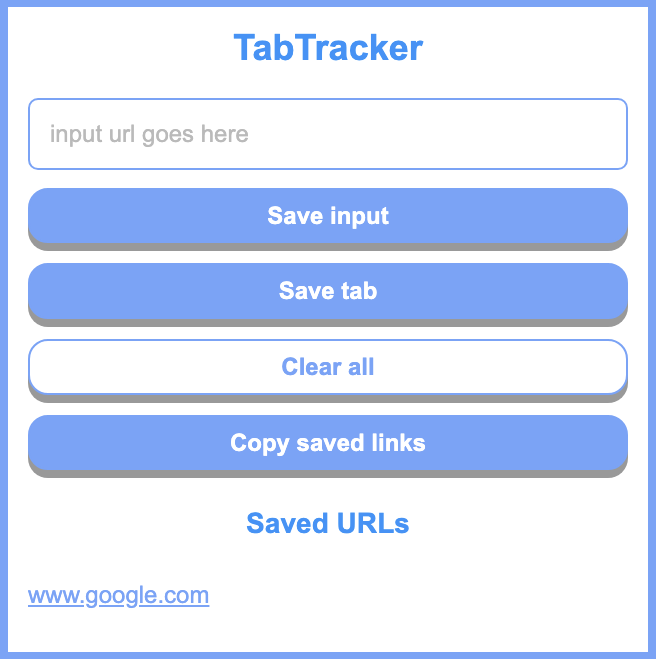

# TabTracker

A Chrome extension to track browser tabs. Allows users to save links to browser local storage and copy saved links. Keyboard shortcut to open the extension is CTRL + SHIFT + F.

Extension currently under review for Chrome Web Store.

## Credit

Spin off of project from [Scrimba Learn Javascript Course](https://scrimba.com/learn/learnjavascript)

<a href="https://www.flaticon.com/free-icons/save" title="save icons">Save icons created by Freepik - Flaticon</a>
