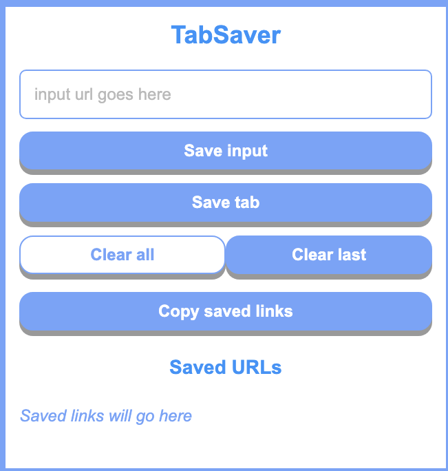

# TabSaver

A Chrome extension to save URLs that may be important to you. Allows users to save links to browser local storage and easily access or copy their saved links. Users can manually input URLs to save into their browser local storage via a simple button press. Alternatively, they can just save the currently open tab link. Keyboard shortcut to open the extension is Ctrl + Shift + F.

## Extension link
https://chrome.google.com/webstore/detail/tabsaver/ehhmbjnkbeeipiajfmdcllionbelillm?hl=en

## Credit

Spin off of project from [Scrimba Learn Javascript Course](https://scrimba.com/learn/learnjavascript)

<a href="https://www.flaticon.com/free-icons/save" title="save icons">Save icons created by Freepik - Flaticon</a>
